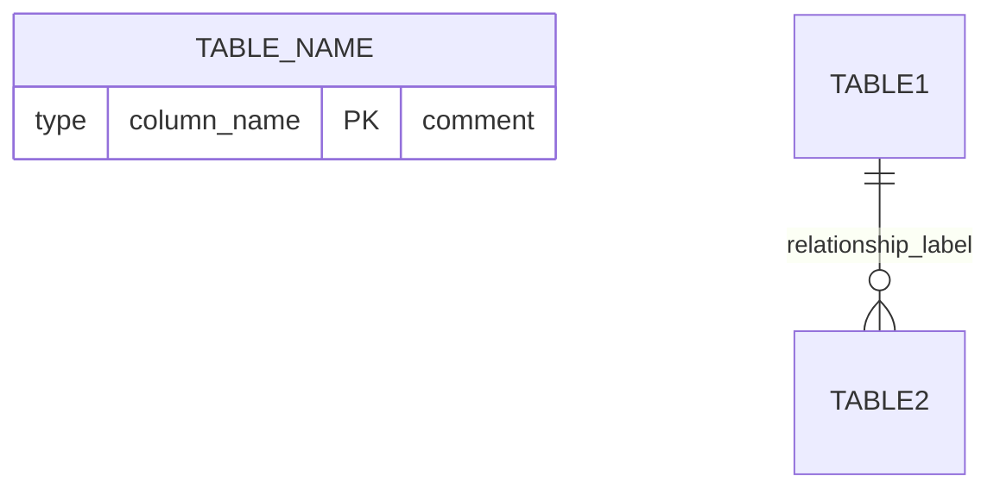
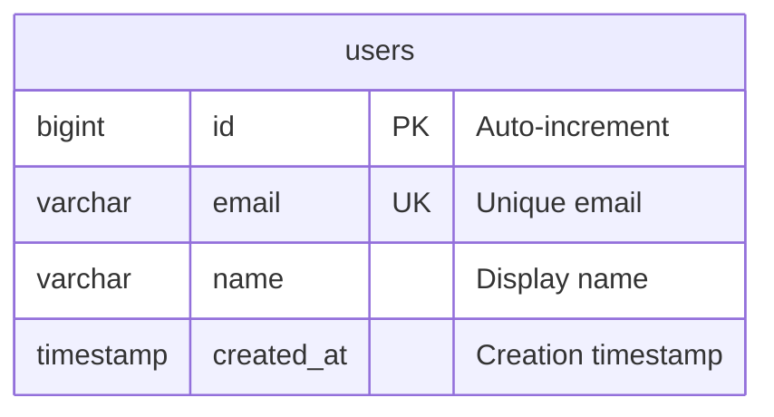
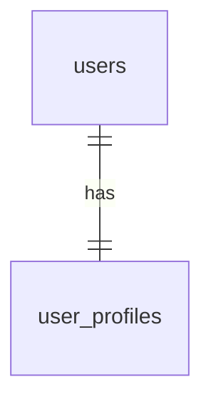
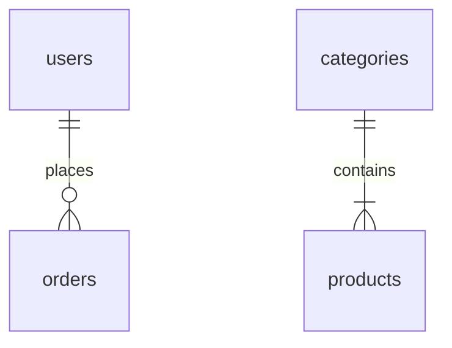
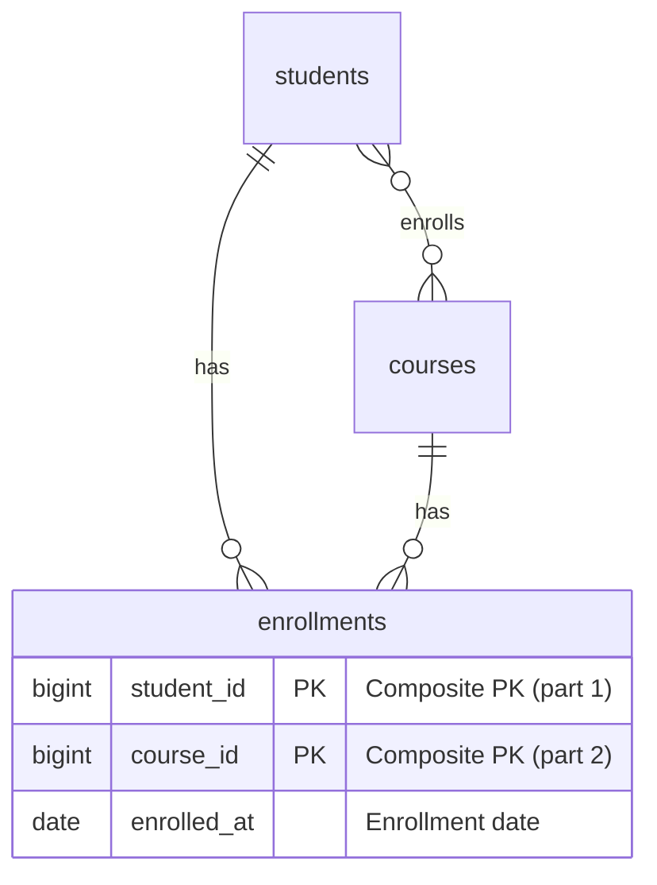
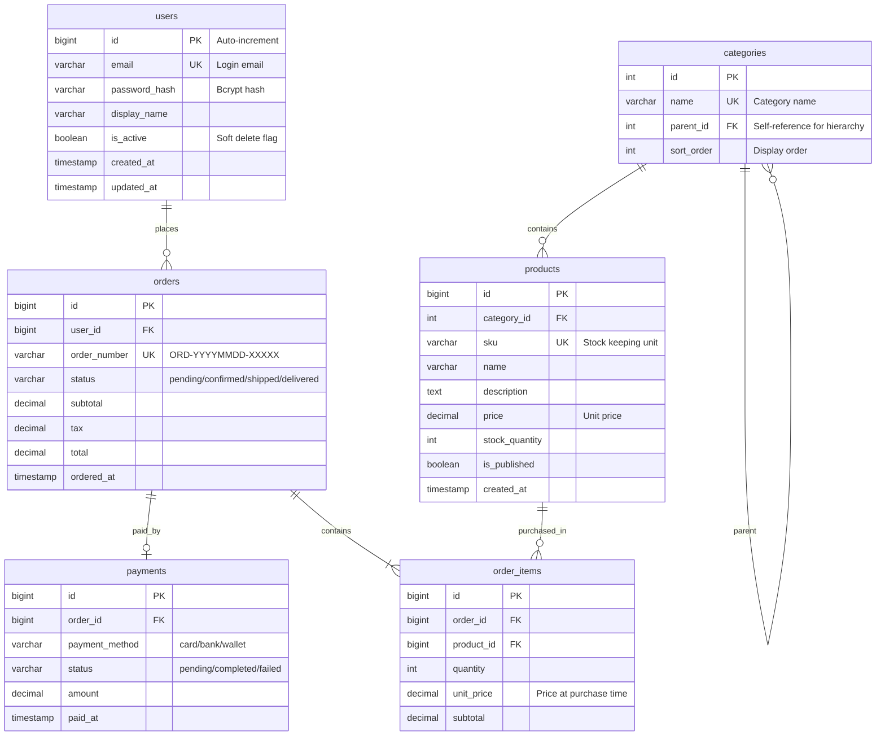
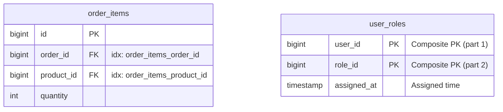

# Mermaid ER Diagram Skill

Generate precise, readable Mermaid ER diagrams with complete database metadata.

## Syntax Reference

### Basic Structure



### Data Types

Use standard SQL-like types for clarity:

- `int`, `bigint`, `serial` - Integer types
- `varchar`, `text`, `char` - String types
- `boolean`, `bool` - Boolean
- `date`, `datetime`, `timestamp` - Temporal
- `decimal`, `float`, `double` - Numeric
- `uuid`, `json`, `jsonb` - Special types

### Key Annotations

| Annotation | Meaning     | Usage                     |
| ---------- | ----------- | ------------------------- |
| `PK`       | Primary Key | Single column primary key |
| `FK`       | Foreign Key | References another table  |
| `UK`       | Unique Key  | Unique constraint         |

### Attribute Format

```
type column_name [PK|FK|UK] ["comment"]
```

Examples:



### Cardinality Symbols

| Left   | Right  | Meaning             |
| ------ | ------ | ------------------- |
| `\|o`  | `o\|`  | Zero or one (0..1)  |
| `\|\|` | `\|\|` | Exactly one (1)     |
| `}o`   | `o{`   | Zero or more (0..n) |
| `}\|`  | `\|{`  | One or more (1..n)  |

### Relationship Patterns

**1:1 Relationship (One-to-One)**



**1:n Relationship (One-to-Many)**



**n:n Relationship (Many-to-Many)**
Use junction/bridge table:



### Line Styles

| Syntax | Meaning                                    |
| ------ | ------------------------------------------ |
| `--`   | Solid line (identifying relationship)      |
| `..`   | Dashed line (non-identifying relationship) |

## Layout Best Practices

### 1. Logical Grouping

Group related entities together:

- **Transaction tables**: Center/left, arranged by workflow order
- **Master tables**: Right side, referenced by transactions
- **Junction tables**: Between the tables they connect

### 2. Relationship Flow

- Parent tables above or left of child tables
- Transaction flow: left-to-right chronologically
- Foreign keys point from child to parent

### 3. Readability Rules

- Minimize crossing lines
- Keep related entities close
- Use meaningful relationship labels
- Add comments for non-obvious columns

## Complete Example



## Index & Constraint Notation

For indexes and composite keys, use comments:



## Output Checklist

Before finalizing, verify:

- [ ] All PKs marked with `PK`
- [ ] All FKs marked with `FK`
- [ ] Composite keys are represented by marking each participating column as `PK`
- [ ] Data types are specified for all columns
- [ ] Cardinality accurately reflects business rules
- [ ] Relationship labels are meaningful
- [ ] Comments explain non-obvious columns
- [ ] Indexes noted in comments where relevant
- [ ] Tables logically grouped (masters vs transactions)
