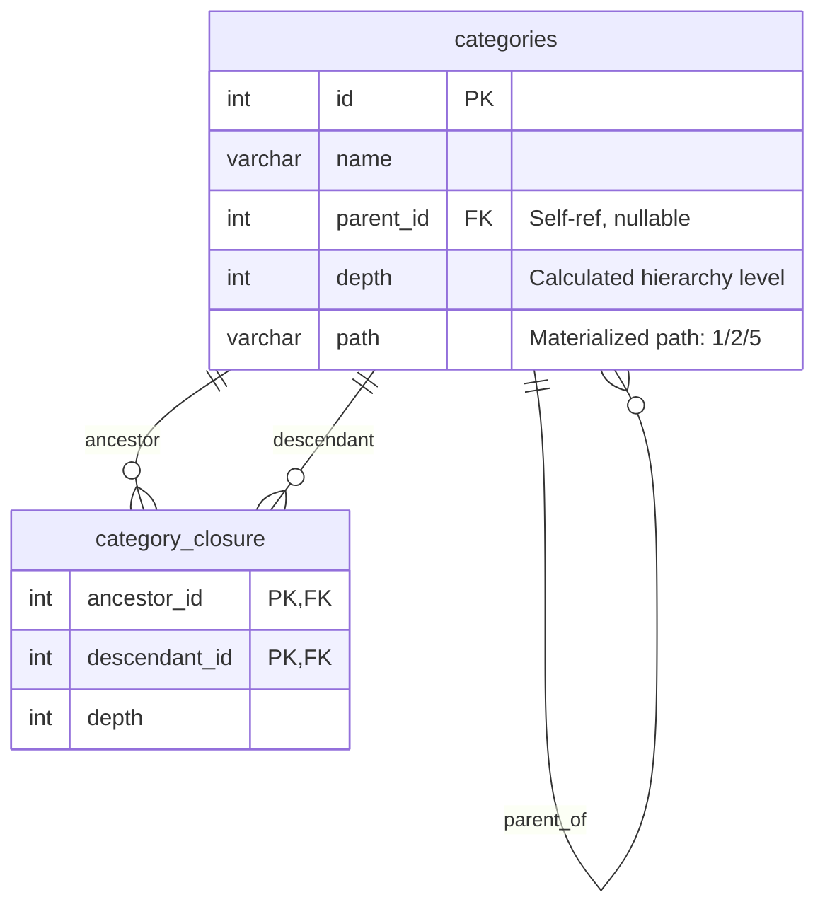
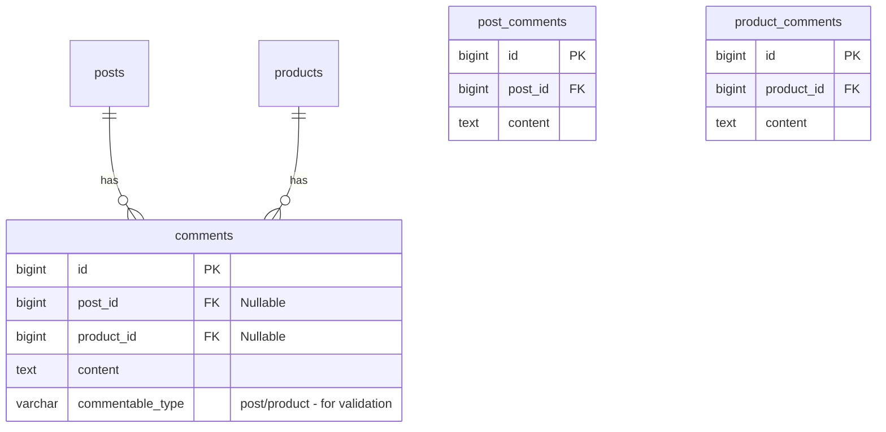
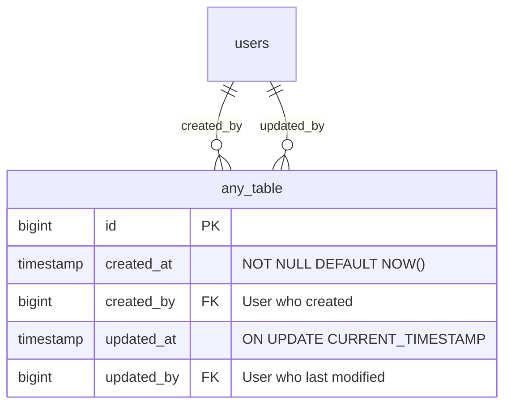
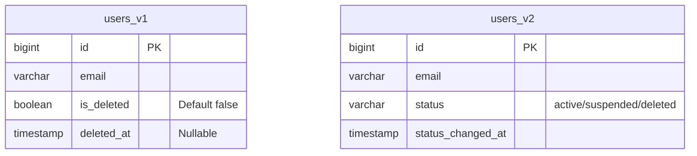
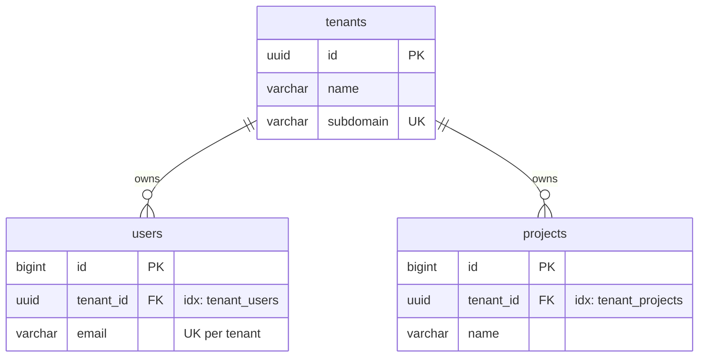
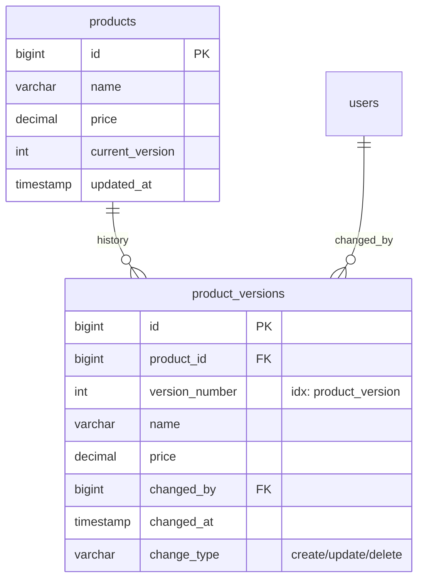
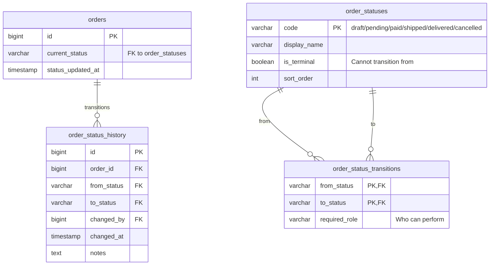
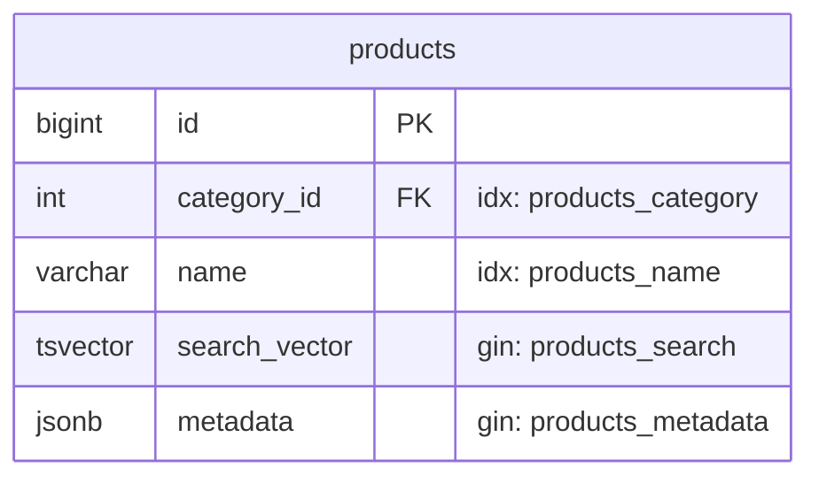
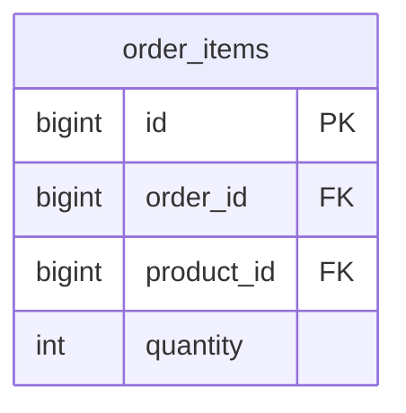

# Advanced ER Diagram Patterns

## Table of Contents

1. [Self-Referencing Tables](#self-referencing-tables)
2. [Polymorphic Relationships](#polymorphic-relationships)
3. [Audit Columns Pattern](#audit-columns-pattern)
4. [Soft Delete Pattern](#soft-delete-pattern)
5. [Multi-Tenant Pattern](#multi-tenant-pattern)
6. [Versioning Pattern](#versioning-pattern)
7. [State Machine Pattern](#state-machine-pattern)

---

## Self-Referencing Tables

Hierarchical data (categories, org charts, comments):

## Polymorphic Relationships

When multiple tables share a relationship type:

## Audit Columns Pattern

Standard audit fields for all entities:

## Soft Delete Pattern

## Multi-Tenant Pattern

## Versioning Pattern

Track changes over time:

## State Machine Pattern

Order lifecycle with valid transitions:

## Index Notation Conventions

Document indexes in comments:

| Prefix   | Meaning         | Example                      |
| -------- | --------------- | ---------------------------- |
| `idx:`   | B-tree index    | `"idx: users_email"`         |
| `uidx:`  | Unique index    | `"uidx: users_tenant_email"` |
| `gist:`  | GiST index      | `"gist: locations_coords"`   |
| `gin:`   | GIN index       | `"gin: posts_tags"`          |
| `btree:` | Explicit B-tree | `"btree: orders_created_at"` |

Example:

## Composite Index Notation

