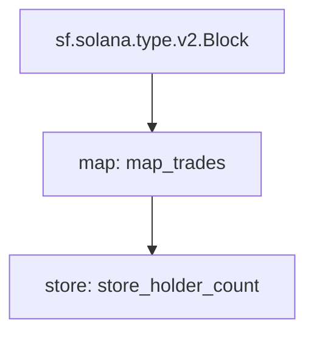

# Substreams CLI Commands Reference

## Installation

```bash
# macOS
brew install streamingfast/tap/substreams

# Linux
LINK=$(curl -s https://api.github.com/repos/streamingfast/substreams/releases/latest | \
  awk "/download.url.*linux_x86_64/ {print \$2}" | sed 's/"//g')
curl -L $LINK | tar zxf -
sudo mv substreams /usr/local/bin/

# Verify
substreams --version
```

## Required Dependencies

```bash
# Rust with WASM target
curl --proto '=https' --tlsv1.2 -sSf https://sh.rustup.rs | sh
rustup target add wasm32-unknown-unknown

# Buf (protobuf generation)
# See https://buf.build/docs/installation
```

## Command Reference

### `substreams init`

Initialize a new Substreams project interactively.

```bash
substreams init
```

**Generated files:**

- `substreams.yaml` - Manifest
- `proto/` - Protobuf definitions
- `src/lib.rs` - Rust module handlers
- `Cargo.toml` - Rust dependencies

**Options:**

- Choose blockchain (Ethereum, Solana, etc.)
- Choose template type

---

### `substreams build`

Build the Substreams package (proto generation + WASM compilation).

```bash
substreams build
```

**Generated files:**

- `src/pb/` - Rust code from protobuf
- `src/pb/mod.rs` - Module exports
- `<package-name>-v<version>.spkg` - Compiled package

**What happens internally:**

1. Runs `buf generate` (or internal equivalent) → generates `src/pb/`
2. Runs `cargo build --target wasm32-unknown-unknown --release`
3. Packages WASM + manifest + proto into `.spkg`

**Flags:**

```bash
--skip-proto    # Skip protobuf generation
--output-file   # Custom .spkg output path
```

---

### `substreams protogen`

Generate Rust code from protobuf only (no WASM compile).

```bash
substreams protogen ./substreams.yaml
```

**Generated files:**

- `src/pb/` - Rust structs from proto

**Use when:**

- Proto files changed, need quick type check
- Debugging proto → Rust generation issues

**Flags:**

```bash
--exclude-paths "sf/substreams,google"  # Exclude system protos
--output-path ./src/pb                   # Custom output
```

---

### `substreams run`

Run a module and stream output to terminal.

```bash
substreams run ./substreams.yaml <module_name> \
  -e <endpoint> \
  -s <start_block> \
  -t <stop_block>
```

**Examples:**

```bash
# Run 10 blocks from block 280000000
substreams run ./substreams.yaml map_trades \
  -e sol.substreams.pinax.network:443 \
  -s 280000000 \
  -t +10

# Run until specific block
substreams run ./substreams.yaml map_trades \
  -e sol.substreams.pinax.network:443 \
  -s 280000000 \
  -t 280000100

# Run from .spkg package
substreams run ./my-package-v0.1.0.spkg map_trades \
  -e sol.substreams.pinax.network:443 \
  -s 280000000 \
  -t +10
```

**Output formats (-o):**

- `ui` - Interactive UI with progress (default)
- `json` - Indented JSON stream
- `jsonl` - JSON Lines (one per line)
- `clock` - Block timing info only

**Flags:**

```bash
-e, --endpoint       # Substreams endpoint
-s, --start-block    # Start block number
-t, --stop-block     # Stop block (+N for relative)
-o, --output         # Output format: ui, json, jsonl
-p, --params         # Override module params
-H                   # HTTP headers (e.g., parallel workers)
```

---

### `substreams gui`

Interactive terminal GUI for debugging.

```bash
substreams gui ./substreams.yaml <module_name> \
  -e <endpoint> \
  -s <start_block> \
  -t <stop_block>
```

**Keyboard shortcuts:**
| Key | Action |
|-----|--------|
| `Tab` | Switch screen (Request/Progress/Output) |
| `r` | Restart stream |
| `q` | Quit |
| `p` | Next block |
| `o` | Previous block |
| `=` + number + Enter | Go to block |
| `i` | Next module |
| `u` | Previous module |
| `/` + text + Enter | Search |
| `?` | Help |

**Replay mode:**

```bash
# Saves session to replay.log
substreams gui ...

# Reload without hitting server
substreams gui --replay ./substreams.yaml <module>
```

---

### `substreams info`

Inspect package contents.

```bash
substreams info ./my-package.spkg
substreams info ./substreams.yaml
```

**Output includes:**

- Package name, version, doc
- All modules with inputs/outputs
- Module hashes

---

### `substreams graph`

Generate Mermaid diagram of module DAG.

```bash
substreams graph ./substreams.yaml
```

**Output:**



Paste into [Mermaid Live Editor](https://mermaid.live) to visualize.

---

### `substreams inspect`

Deep inspection of package internals (debugging).

```bash
substreams inspect ./substreams.yaml | less
```

---

## Authentication

```bash
# Set API token
export SUBSTREAMS_API_TOKEN="your-token"

# Or pass via header
substreams run ... -H "Authorization: Bearer $TOKEN"
```

Get tokens from:

- https://app.streamingfast.io
- https://pinax.network

---

## Parallel Execution

```bash
# Increase parallel workers (default: 10)
substreams run ... -H "X-Substreams-Parallel-Workers: 20"
```

---

## File Generation Summary

| Command    | src/pb/ | .spkg | WASM |
| ---------- | ------- | ----- | ---- |
| `init`     | ❌      | ❌    | ❌   |
| `protogen` | ✅      | ❌    | ❌   |
| `build`    | ✅      | ✅    | ✅   |
| `run`      | ❌      | ❌    | ❌   |
| `gui`      | ❌      | ❌    | ❌   |

---

## Manifest stdin Support

Commands supporting `-` for stdin:

- `build`, `run`, `gui`, `info`, `graph`, `pack`, `protogen`, `inspect`

```bash
# Dynamic manifest with env substitution
envsubst < substreams.yaml.template | substreams build --manifest "-"
```
